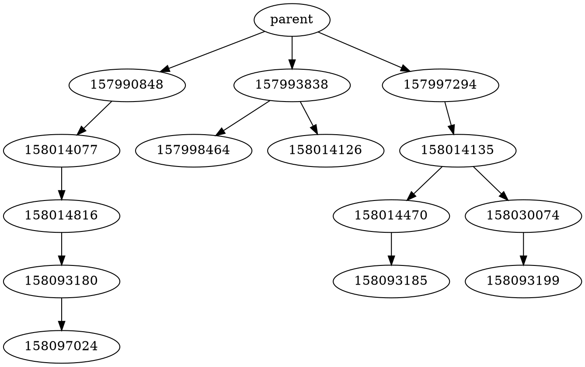

<div align="center">


# Fur Affinity API

Python library to implement API-like functionality for the [Fur Affinity](https://furaffinity.net) website.

[](https://pypi.org/project/faapi/)
[](https://www.python.org)

[](https://github.com/FurryCoders/faapi)
[](https://github.com/FurryCoders/FAAPI/issues)
[](https://github.com/FurryCoders/FAAPI/actions/workflows/test.yml)

</div>

## Requirements

Python 3.9+ is necessary to run this
library. [ Poetry](https://python-poetry.org)
is used for packaging and dependency management.

## Usage

The API comprises a main class `FAAPI`, two submission classes `Submission` and `SubmissionPartial`, a journal
class `Journal`, and a user class `User`.

Once `FAAPI` is initialized, its methods can be used to crawl FA and return parsed objects.

```python
from requests.cookies import RequestsCookieJar
import faapi
import orjson

cookies = RequestsCookieJar()
cookies.set("a", "38565475-3421-3f21-7f63-3d341339737")
cookies.set("b", "356f5962-5a60-0922-1c11-65003b70308")

api = faapi.FAAPI(cookies)
sub, sub_file = api.submission(12345678, get_file=True)

print(sub.id, sub.title, sub.author, f"{len(sub_file) / 1024:02f}KiB")

with open(f"{sub.id}.json", "wb") as f:
    f.write(orjson.dumps(dict(sub)))

with open(sub.file_url.split("/")[-1], "wb") as f:
    f.write(sub_file)

gallery, _ = api.gallery("user_name", 1)
with open("user_name-gallery.json", "wb") as f:
    f.write(orjson.dumps(list(map(dict, gallery))))
```

### robots.txt

At init, the `FAAPI` object downloads the [robots.txt](https://www.furaffinity.net/robots.txt) file from FA to determine
the `Crawl-delay` and `disallow` values set therein. If not set in the robots.txt file, a crawl delay value of 1 second
is used.

To respect this value, the default behaviour of the `FAAPI` object is to wait when a get request is made if the last
request was performed more recently then the crawl delay value.

See under [FAAPI](#faapi) for more details on this behaviour.

Furthermore, any get operation that points to a disallowed path from robots.txt will raise an exception. This check
should not be circumvented, and the developer of this library does not take responsibility for violations of the TOS of
Fur Affinity.

### Cookies

To access protected pages, cookies from an active session are needed. These cookies can be given to the FAAPI object as
a list of dictionaries - each containing a `name` and a `value` field -, or as a `http.cookiejar.CookieJar`
object (`requests.cookies.RequestsCookieJar` and other objects inheriting from `CookieJar` are also supported). The
cookies list should look like the following example:

```python
cookies = [
    {"name": "a", "value": "38565475-3421-3f21-7f63-3d3413397537"},
    {"name": "b", "value": "356f5962-5a60-0922-1c11-65003b703038"},
]
```

```python
from requests.cookies import RequestsCookieJar

cookies = RequestsCookieJar()
cookies.set("a", "38565475-3421-3f21-7f63-3d3413397537")
cookies.set("b", "356f5962-5a60-0922-1c11-65003b703038")
```

To access session cookies, consult the manual of the browser used to log in.

*Note:* it is important to not logout of the session the cookies belong to, otherwise they will no longer work.
*Note:* as of April 2022 only cookies `a` and `b` are needed.

### User Agent

`FAAPI` attaches a `User-Agent` header to every request. The user agent string is generated at startup in the following
format: `faapi/{library version} Python/{python version} {system name}/{system release}`.

## Objects

### FAAPI

This is the main object that handles all the calls to scrape pages and get submissions.

It holds 6 different fields:

* `session: CloudflareScraper` `cfscrape` session used for get requests
* `robots: urllib.robotparser.RobotFileParser` robots.txt handler
* `user_agent: str` user agent used by the session (property, cannot be set)
* `crawl_delay: float` crawl delay from robots.txt (property, cannot be set)
* `last_get: float` time of last get (UNIX time)
* `raise_for_unauthorized: bool = True` if set to `True`, raises an exception if a request is made and the resulting
  page is not from a login session

#### Init

`__init__(cookies: list[dict[str, str]] | CookieJar)`

The class init has a single argument for the cookies. Cookies must be in the format mentioned above
in [#Cookies](#cookies).

#### Methods & Properties

* `load_cookies(cookies: list[dict[str, str]] | CookieJar)`<br>
  Load new cookies and create a new session.<br>
  *Note:* This method removes any cookies currently in use, to update/add single cookies access them from the session
  object.
* `handle_delay()`<br>
  Handles the crawl delay as set in the robots.txt
* `check_path(path: str, *, raise_for_disallowed: bool = False) -> bool`<br>
  Checks whether a given path is allowed by the robots.txt. If `raise_for_disallowed` is set to `True`
  a `DisallowedPath` exception is raised on non-allowed paths.
* `connection_status -> bool`<br>
  Returns the status of the connection.
* `login_status -> bool`<br>
  Returns the login status.
* `get(path: str, **params) -> requests.Response`<br>
  This returns a response object containing the result of the get operation on the given URL with the
  optional `**params` added to it (url provided is considered as path from 'https://www.furaffinity.net/').
* `get_parsed(path: str, *, skip_page_check: bool = False, skip_auth_check: bool = False, **params) -> bs4.BeautifulSoup`<br>
  Similar to `get()` but returns the parsed HTML from the normal get operation. If the GET request encountered an error,
  an `HTTPError` exception is raised. If `skip_page_check` is set to `True`, the parsed page is not checked for errors (
  e.g. non-existing submission). If `skip_auth_check` is set to `True`, the page is not checked for login status.
* `me() -> User | None`<br>
  Returns the logged-in user as a `User` object if the cookies are from a login session.
* `frontpage() -> list[SubmissionPartial]`<br>
  Fetch the latest submissions from Fur Affinity's front page.
* `submission(submission_id: int, get_file: bool = False, *, chunk_size: int = None) -> tuple[Submission, bytes | None]`<br>
  Given a submission ID, it returns a `Submission` object containing the various metadata of the submission itself and
  a `bytes` object with the submission file if `get_file` is passed as `True`. The optional `chunk_size` argument is
  used for the request; if left to `None` or set to 0 the download is performed directly without streaming.<br>
  *Note:* the author `UserPartial` object of the submission does not contain the `join_date` field as it does not appear
  on submission pages.
* `submission_file(submission: Submission, *, chunk_size: int = None) -> bytes`<br>
  Given a submission object, it downloads its file and returns it as a `bytes` object. The optional `chunk_size`
  argument is used for the request; if left to `None` or set to 0 the download is performed directly without streaming.
* `journal(journal_id: int) -> Journal`<br>
  Given a journal ID, it returns a `Journal` object containing the various metadata of the journal.
* `user(user: str) -> User`<br>
  Given a username, it returns a `User` object containing information regarding the user.
* `gallery(user: str, page: int = 1) -> tuple[list[SubmissionPartial], int]`<br>
  Returns the list of submissions found on a specific gallery page, and the number of the next page. The returned page
  number is set to 0 if it is the last page.
* `scraps(user: str, page: int = 1) -> -> tuple[list[SubmissionPartial], int]`<br>
  Returns the list of submissions found on a specific scraps page, and the number of the next page. The returned page
  number is set to 0 if it is the last page.
* `favorites(user: str, page: str = "") -> tuple[list[SubmissionPartial], str]`<br>
  Downloads a user's favorites page. Because of how favorites pages work on FA, the `page` argument (and the one
  returned) are strings. If the favorites page is the last then an empty string is returned as next page. An empty page
  value as argument is equivalent to page 1.<br>
  *Note:* favorites page "numbers" do not follow any scheme and are only generated server-side.
* `journals(user: str, page: int = 1) -> -> tuple[list[JournalPartial], int]`<br>
  Returns the list of submissions found on a specific journals page, and the number of the next page. The returned page
  number is set to 0 if it is the last page.
* `watchlist_to(self, user: str) -> list[User]`<br>
  Given a username, returns a list of `User` objects for each user that is watching the given user.
* `watchlist_by(self, user: str) -> list[User]`<br>
  Given a username, returns a list of `User` objects for each user that is watched by the given user.

### JournalPartial

This object contains partial information gathered when parsing a journals folder. It contains the following fields:

* `id: int` journal ID
* `title: str` journal title
* `date: datetime` upload date as a [`datetime` object](https://docs.python.org/3/library/datetime.html) (defaults to
  timestamp 0)
* `author: UserPartial` journal author (filled only if the journal is parsed from a `bs4.BeautifulSoup` page)
* `stats: JournalStats` journal statistics stored in a named tuple (`comments` (count))
* `content: str` journal content in HTML format
* `mentions: list[str]` the users mentioned in the content (if they were mentioned as links, e.g. `:iconusername:`,
  `@username`, etc.)
* `journal_tag: bs4.element.Tag` the journal tag used to parse the object fields

`JournalPartial` objects can be directly cast to a dict object or iterated through.

Comparison with `JournalPartial` can be made with either another `JournalPartial` or `Journal` object (the IDs are
compared), or an integer (the `JournalPartial.id` value is compared to the given integer).

#### Init

`__init__(journal_tag: bs4.element.Tag = None)`

`Journal` takes one optional parameters: a journal section tag from a journals page.

If no `journal_tag` is passed then the object fields will remain at their default - empty - value.

#### Methods

* `url -> str`<br>
  Property method that returns the Fur Affinity URL to the journal (`https://www.furaffinity.net/journal/{id}`).
* `parse(journal_item: bs4.element.Tag = None)`<br>
  Parses the stored journal tag for information. If `journal_tag` is passed, it overwrites the existing `journal_tag`
  value.

### Journal

This object contains full information gathered when parsing a journal page. It contains the same fields
as `JournalPartial` with the addition of comments:

* `id: int` journal ID
* `title: str` journal title
* `date: datetime` upload date as a [`datetime` object](https://docs.python.org/3/library/datetime.html) (defaults to
  timestamp 0)
* `author: UserPartial` journal author (filled only if the journal is parsed from a `bs4.BeautifulSoup` page)
* `stats: JournalStats` journal statistics stored in a named tuple (`comments` (count))
* `header: str` journal header in HTML format (if present)
* `footer: str` journal footer in HTML format (if present)
* `content: str` journal content in HTML format
* `mentions: list[str]` the users mentioned in the content (if they were mentioned as links, e.g. `:iconusername:`,
  `@username`, etc.)
* `comments: list[Comments]` the comments to the journal, organised in a tree structure
* `journal_page: bs4.BeautifulSoup` the journal page used to parse the object fields

`Journal` objects can be directly cast to a dict object or iterated through.

Comparison with `Journal` can be made with either another `Journal` or `JournalPartial` object (the IDs are compared),
or an integer (the `Journal.id` value is compared to the given integer).

#### Init

`__init__(journal_page: bs4.BeautifulSoup = None)`

`Journal` takes one optional journal page argument.

If no `journal_page` is passed then the object fields will remain at their default - empty - value.

#### Methods

* `url -> str`<br>
  Property method that returns the Fur Affinity URL to the journal (`https://www.furaffinity.net/journal/{id}`).
* `parse(journal_page: bs4.BeautifulSoup = None)`<br>
  Parses the stored journal tag for information. If `journal_tag` is passed, it overwrites the existing `journal_tag`
  value.

### SubmissionPartial

This lightweight submission object is used to contain the information gathered when parsing gallery, scraps, and
favorites pages. It contains only the following fields:

* `id: int` submission ID
* `title: str` submission title
* `author: UserPartial` submission author (only the `name` field is filled)
* `rating: str` submission rating [general, mature, adult]
* `type: str` submission type [text, image, etc...]
* `thumbnail_url: str` the URL to the submission thumbnail
* `submission_figure: bs4.element.Tag` the figure tag used to parse the object fields

`SubmissionPartial` objects can be directly cast to a dict object or iterated through.

Comparison with `Submission` can be made with either another `SubmissionPartial` or `Submission` object (the IDs are
compared), or an integer (the `Submission.id` value is compared to the given integer).

#### Init

`__init__(submission_figure: bs4.element.Tag = None)`

To initialise the object, an optional `bs4.element.Tag` object is needed containing the parsed HTML of a submission
figure tag.

If no `submission_figure` is passed then the object fields will remain at their default - empty - value.

#### Methods

* `url -> str`<br>
  Property method that returns the Fur Affinity URL to the submission (`https://www.furaffinity.net/view/{id}`).
* `parse(submission_figure: bs4.element.Tag = None)`<br>
  Parses the stored submission figure tag for information. If `submission_figure` is passed, it overwrites the
  existing `submission_figure` value.

### Submission

The main class that parses and holds submission metadata.

* `id: int` submission ID
* `title: str` submission title
* `author: UserPartial` submission author (only the `name`, `title`, and `user_icon_url` fields are filled)
* `date: datetime` upload date as a [`datetime` object](https://docs.python.org/3/library/datetime.html) (defaults to
  timestamp 0)
* `tags: list[str]` tags list
* `category: str` category
* `species: str` species
* `gender: str` gender
* `rating: str` rating
* `stats: SubmissionStats` submission statistics stored in a named tuple (`views`, `comments` (count), `favorites`)
* `type: str` submission type (text, image, etc...)
* `description: str` description in HTML format
* `mentions: list[str]` the users mentioned in the description (if they were mentioned as links, e.g. `:iconusername:`,
  `@username`, etc.)
* `folder: str` the submission folder (gallery or scraps)
* `file_url: str` the URL to the submission file
* `thumbnail_url: str` the URL to the submission thumbnail
* `prev: int` the ID of the previous submission (if any)
* `next: int` the ID of the next submission (if any)
* `favorite: bool` `True` if the submission is a favorite, `False` otherwise
* `favorite_toggle_link: str` the link to toggle the favorite status (`/fav/` or `/unfav/` type URL)
* `comments: list[Comments]` the comments to the submission, organised in a tree structure
* `submission_page: bs4.BeautifulSoup` the submission page used to parse the object fields

`Submission` objects can be directly cast to a dict object and iterated through.

Comparison with `Submission` can be made with either another `Submission` or `SubmissionPartial` object (the IDs are
compared), or an integer (the `Submission.id` value is compared to the given integer).

#### Init

`__init__(submission_page: bs4.BeautifulSoup = None)`

To initialise the object, an optional `bs4.BeautifulSoup` object is needed containing the parsed HTML of a submission
page.

If no `submission_page` is passed then the object fields will remain at their default - empty - value.

#### Methods

* `url -> str`<br>
  Property method that returns the Fur Affinity URL to the submission (`https://www.furaffinity.net/view/{id}`).
* `parse(submission_page: bs4.BeautifulSoup = None)`<br>
  Parses the stored submission page for metadata. If `submission_page` is passed, it overwrites the
  existing `submission_page` value.

### Comment

This object class contains comment metadata and is used to build a tree structure with the comments and their replies.

* `id: int` the comment ID
* `author: UserPartial` the user who posted the comment
* `date: datetime` the date the comment was posted
* `text: str` the comment text in HTML format
* `replies: list[Comment]` list of replies to the comment
* `reply_to: Comment | int | None` the parent comment, if the comment is a reply. The variable type is `int` only if the
  comment is parsed outside the parse method of a `Submission` or `Journal` (e.g. by creating a new comment with a
  comment tag), and when iterating over the parent object (to avoid infinite recursion errors), be it `Submission`
  , `Journal` or another `Comment`.
* `edited: bool` `True` if the comment was edited, `False` otherwise
* `hidden: bool` `True` if the comment was hidden, `False` otherwise (if the comment was hidden, the author and date
  fields will default to their empty values)
* `parent: Submission | Journal | None` the `Submission` or `Journal` object the comments are connected to
* `comment_tag: bs4.element.Tag` the comment tag used to parse the object fields

`Comment` objects can be directly cast to a dict object and iterated through.

Comparison with `Comment` can be made with either another comment (the IDs are compared), or an integer (
the `Comment.id` value is compared to the given integer).

*Note:* The `__iter__` method of `Comment` objects automatically removes recursion. The `parent` variable is set
to `None` and `reply_to` is set to the comment's ID.<br/>
*Note:* Because each comment contains the parent `Submission` or `Journal` object (which contains the comment itself)
and the replied comment object, some iterations may cause infinite recursion errors, for example when using
the `copy.deepcopy` function. If such iterations are needed, simply set the `parent` variable to `None` and
the `reply_to` variable to `None` or the comment's ID (this can be done easily after flattening the comments list
with `faapi.comment.flatten_comments`, the comments can then be sorted again with `faapi.comment.sort_comments` which
will also restore the `reply_to` values to `Comment` objects).

#### Init

`__init__(self, tag: bs4.element.Tag = None, parent: Submission | Journal = None)`

To initialise the object, an optional `bs4.element.Tag` object is needed containing the comment tag as taken from a
submission/journal page.

The optional `parent` argument sets the `parent` variable described above.

If no `tag` is passed then the object fields will remain at their default - empty - value.

#### Methods

* `url -> str`<br>
  Property method that returns the Fur Affinity URL to the comment (
  e.g. `https://www.furaffinity.net/view/12345678#cid:1234567890`). If the `parent` variable is `None`, the property
  returns an empty string.
* `parse(tag: bs4.element.Tag = None)`<br>
  Parses the stored tag for metadata. If `tag` is passed, it overwrites the existing `tag` value.

#### Extra Functions

These extra functions can be used to operate on a list of comments. They only alter the order and structure, but they do
not touch any of the metadata.

* `faapi.comment.sort_comments(comments: list[Comment]) -> list[Comment]`<br/>
  Sorts a list of comments into a tree structure. Replies are overwritten.
* `faapi.comment.flatten_comments(comments: list[Comment]) -> list[Comment]`<br/>
  Flattens a list of comments. Replies are not modified.

#### Comment Tree Graphs

Using the tree structure generated by the library, it is trivial to build a graph visualisation of the comment tree
using the [DOT](https://www.graphviz.org/doc/info/lang.html) language.

```python
submission, _ = api.submission(12345678)
comments = faapi.comment.flatten_comments(submission.comments)
with open("comments.dot", "w") as f:
    f.write("digraph {\n")
    for comment in [c for c in comments if c.reply_to is None]:
        f.write(f"    parent -> {comment.id}\n")
    for comment in comments:
        for reply in comment.replies:
            f.write(f"    {comment.id} -> {reply.id}\n")
    f.write("}")
```




_The graph above was generated with [quickchart.io](https://quickchart.io/documentation/graphviz-api/)_

### UserPartial

A stripped-down class that holds basic user information. It is used to hold metadata gathered when parsing a submission,
journal, gallery, scraps, etc.

* `name: str` display name with capital letters and extra characters such as "_"
* `status: str` user status (~, !, etc.)
* `title: str` the user title as it appears on their userpage
* `join_date: datetime` the date the user joined (defaults to timestamp 0)
* `user_tag: bs4.element.Tag` the user element used to parse information (placeholder, `UserPartial` is filled
  externally)

`UserPartial` objects can be directly cast to a dict object and iterated through.

Comparison with `UserPartial` can be made with either another `UserPartial` or `User` object (the URL names are
compared), or a string (the URL name is compared to the given string).

#### Init

`__init__(user_tag: bs4.element.Tag = None)`

To initialise the object, an optional `bs4.element.Tag` object is needed containing the user element from a user page or
user folder.

If no `user_tag` is passed then the object fields will remain at their default - empty - value.

#### Methods

* `name_url -> str`<br>
  Property method that returns the URL-safe username
* `url -> str`<br>
  Property method that returns the Fur Affinity URL to the user (`https://www.furaffinity.net/user/{name_url}`).
* `parse(user_page: bs4.BeautifulSoup = None)`<br>
  Parses the stored user page for metadata. If `user_page` is passed, it overwrites the existing `user_page` value.

### User

The main class storing all of a user's metadata.

* `name: str` display name with capital letters and extra characters such as "_"
* `status: str` user status (~, !, etc.)
* `title: str` the user title as it appears on their userpage
* `join_date: datetime` the date the user joined (defaults to timestamp 0)
* `profile: str` profile text in HTML format
* `stats: UserStats` user statistics sorted in a `namedtuple` (`views`, `submissions`, `favorites`, `comments_earned`
  , `comments_made`, `journals`, `watched_by`, `watching`)
* `info: dict[str, str]` profile information (e.g. "Accepting Trades", "Accepting Commissions", "Character Species",
  etc.)
* `contacts: dict[str, str]` contact links (e.g. Twitter, Steam, etc.)
* `user_icon_url: str` the URL to the user icon
* `watched: bool` `True` if the user is watched, `False` otherwise
* `watched_toggle_link: str | None` The link to toggle the watch status (`/watch/` or `/unwatch/` type link)
* `blocked: bool` `True` if the user is blocked, `False` otherwise
* `blocked_toggle_link: str | None` The link to toggle the block status (`/block/` or `/unblock/` type link)
* `user_page: bs4.BeautifulSoup` the user page used to parse the object fields

`User` objects can be directly cast to a dict object and iterated through.

Comparison with `User` can be made with either another `User` or `UserPartial` object (the URL names are compared), or a
string (the URL name is compared to the given string).

#### Init

`__init__(user_page: bs4.BeautifulSoup = None)`

To initialise the object, an optional `bs4.BeautifulSoup` object is needed containing the parsed HTML of a submission
page.

If no `user_page` is passed then the object fields will remain at their default - empty - value.

#### Methods

* `name_url -> str`<br>
  Property method that returns the URL-safe username
* `url -> str`<br>
  Property method that returns the Fur Affinity URL to the user (`https://www.furaffinity.net/user/{name_url}`).
* `parse(user_page: bs4.BeautifulSoup = None)`<br>
  Parses the stored user page for metadata. If `user_page` is passed, it overwrites the existing `user_page` value.

## Exceptions

The following are the exceptions explicitly raised by the FAAPI functions. The exceptions deriving from `ParsingError`
are chosen depending on the content of the page. Because Fur Affinity doesn't use HTTP status codes besides 404, the
page is checked against a static list of known error messages/page titles in order to determine the specific error to be
used. If no match is found, then the `ServerError` (if the page has the "Server Error" title) or the more
general `NoticeMessage` exceptions are used instead. The actual error message parsed from the page is used as argument
for the exceptions, so that it can be analysed when caught.

* `DisallowedPath(Exception)` The path is not allowed by the robots.txt.
* `Unauthorized(Exception)` The user is not logged-in.
* `ParsingError(Exception)` An error occurred while parsing the page.
    * `NonePage(ParsingError)` The parsed page is `None`.
    * `NotFound(ParsingError)` The resource could not be found (general 404 page or non-existing submission, user, or
      journal).
    * `NoTitle(ParsingError)` The parsed paged is missing a title.
    * `DisabledAccount(ParsingError)` The resource belongs to a disabled account.
    * `ServerError(ParsingError)` The page contains a server error notice.
    * `NoticeMessage(ParsingError)` A notice of unknown type was found in the page.

## Contributing

All contributions and suggestions are welcome!

If you have suggestions for fixes or improvements, you can open an issue with your idea, see [#Issues](#issues) for
details.

## Issues

If any problem is encountered during usage of the program, an issue can be opened
on [GitHub](https://github.com/FurryCoders/FAAPI/issues).

Issues can also be used to suggest improvements and features.

When opening an issue for a problem, please copy the error message and describe the operation in progress when the error
occurred.
